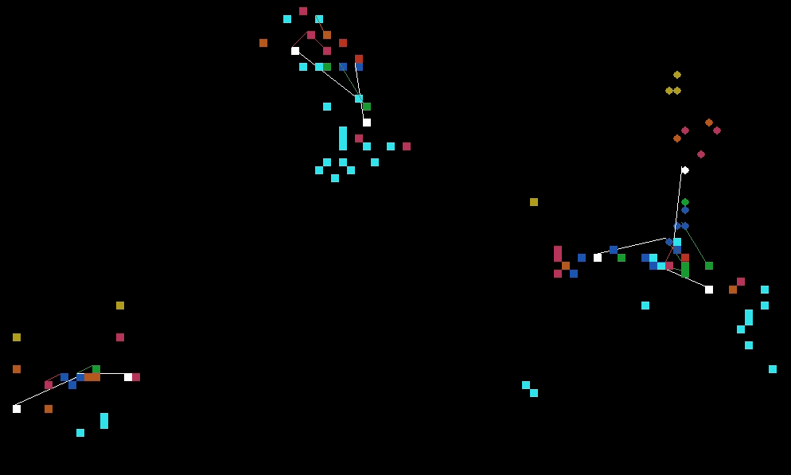

# Swarm

Swarm is a strategy rouge-like space simulator game written with `pygame/python3`.

### Install
    
    pip3 install pygame
    pip3 install Swarm

It's probably best to just download the archive and run the game as it's not set up as a library or anything like that.

### Controls

Hold the `w` `a` `s` and `d` keys or the directional keys to move your mothership around.

Use the `tab` key to enable auto-move.  It will automatically move your mothership towards
it's closest target.

### Instructions

The player controls the mothership (white) in the fleet of circles (squares are enemies).  All ships in a fleet follow the mothership.  The different colors tell you what kind of ship the circle/square represents.  Different ships have different abilities, attack ranges, health pools, speeds, etc.  Even ships of the same type have somewhat randomized stats.

Ships automatically target the closest enemy and motherships will seek out other fleets to destroy.  If a mothership is destroyed, their remaining fleet will surrender to the attacker who destroyed their mothership.  The lines indicate that a ship has a target.  There is no indication that something is attacking other than it will stop moving towards the target.

The game isn't done yet but it is close.  The plan is to randomly spawn in new fleets of enemy ships of increasing difficulty, over time (trivial to implement right now).  I'll also be including a remote python console that is attached to certain game objects to allow the player to change the behavior of their fleet using python.

Here are the ships and their functions:

* White - Mothership.  Controls where the fleet goes and has the most health out of all ships.  When a mothership is destroyed, their remaining fleet will fight for the winning fleet and part of their mothership's stats will go to the winning mothership as well.  This applies to enemy motherships as well, so if an enemy mothership destroys several enemy motherships before you, it will be difficult to destroy.

* Red - Attack - This is the main attack vessel.  It does medium/short ranged attacks and will move towards the mothership's target.

* Green - Ranged Attack - This is another attack vessel that does longer ranged attacks, but is weaker.  This ship will move towards the mothership's target.

* Dark Blue - Tank - This is another attack vessel with higher health, but it does less damage.  This ship will move towards the mothership's target.

* Pink - Repair - This ship targets friendly ships and blasts them with a stream of hull-repairing nano-bots.

* Orange/Brown - The Collector/Builder - This ship targets supplies dropped by destroyed ships.  When the fleet has enough supplies, a random ship is built.

* Yellow - Kamikaze - The kamikaze ship has a long range, is super fast, and will run full speed into enemy ships dealing massive damage.  The kamikaze ship is lost in the process.  It also has very low health so destroying it before it's in range is best!

* Light Blue - Supplies - Supplies are dropped by destroyed ships and can be collected by the Collector/Builder ships.

